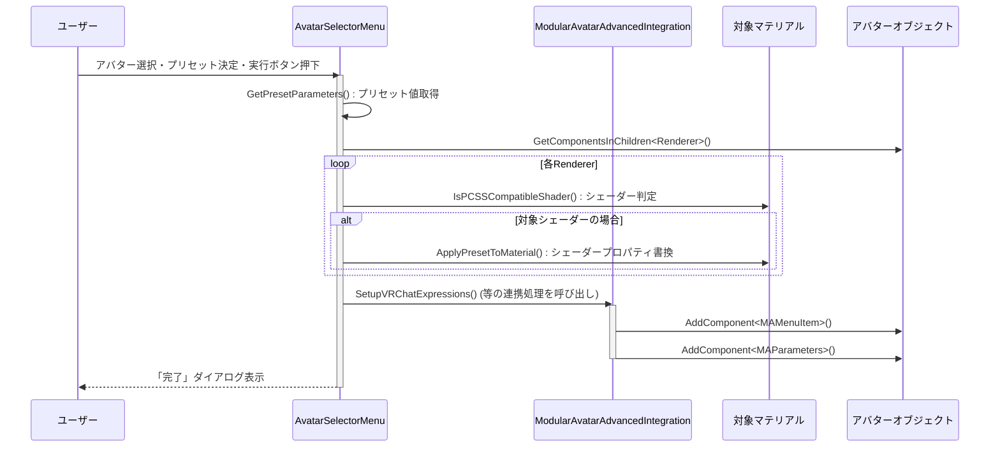

# 総合技術レビュー: lilToon PCSS Extension v2.7.0 (詳細版)

## 1. プロジェクト理念とアーキテクチャ

### 1.1. 設計思想: "ガードレール"としてのツールセット

本プロジェクトのコードベースを貫く設計思想は、単なる機能提供ではなく、VRChatアバター改変プロセスにおけるユーザーの認知負荷を軽減し、潜在的なリスクから保護する「ガードレール」の構築にある。これは、エラーを起こさせない、あるいはエラーが起きても容易に復旧できる環境を提供することで、ユーザーが創造的な活動に集中できるよう支援することを目的としている。この思想は、後述するデータ損失防止機構や各種自動化ツールに色濃く反映されている。

### 1.2. アーキテクチャ概観: Editor拡張とMA連携による非破壊的ワークフロー

アーキテクチャはUnityエディタ拡張が中心であり、`EditorWindow`をUIの起点とし、`ShaderGUI`でマテリアルインスペクタを拡張、`AssetPostprocessor`や`IVRCSDKBuildRequestedCallback`でUnityおよびVRChatのビルドパイプラインにフックする、標準的かつ堅牢な構成を採る。

特筆すべきは、**Modular Avatar (MA) をアーキテクチャの前提**として深く統合している点である。アバターのPrefabを直接変更する破壊的な操作を極力避け、MAのコンポーネント（`MAMaterialSwap`, `MAMenuItem`など）を動的に生成・設定することで、全ての変更を非破壊的に行う。これにより、ユーザーはいつでも導入前の状態に安全に戻すことができ、他のアセットとの競合リスクも大幅に低減される。

## 2. 主要機能のシーケンス分析

### 2.1. ワンクリックセットアップの処理フロー

ユーザーが `AvatarSelectorMenu` でセットアップを実行した際の内部シーケンスは以下の通り。

### 2.2. 自動バックアップのイベント駆動フロー

VRChatへのアップロード時に実行される自動バックアップは、イベント駆動アーキテクチャの一例である。

1.  **イベントトリガー**: ユーザーがVRChat SDKのアップロードボタンを押下。
2.  **イベントリスナー**: `IVRCSDKBuildRequestedCallback` を実装した `AutomatedMaterialBackup` クラスの `OnBuildRequested` メソッドがVRChatのビルドパイプラインから呼び出される。
3.  **処理実行**: `MaterialBackup.BackupMaterials()` が実行され、対象アバターの全マテリアル情報をGUIDベースでJSONファイルにシリアライズし、プロジェクト内に保存する。
4.  **プロセス継続**: メソッドが `true` を返すことで、通常のビルドプロセスが続行される。

この設計により、ユーザーはバックアップを意識することなく、常に安全な状態でアップロードに臨むことができる。

## 3. シェーダー実装の詳細分析

### 3.1. PCSS実装とパフォーマンス・トレードオフ

PCSS（Percentage-Closer Soft Shadows）の品質は、ブロッカ（遮蔽物）の探索範囲と、影の半影（Penumbra）をぼかすためのフィルタリング範囲の2つに依存する。`lilToon_PCSS_Extension.shader` では、これらの計算負荷をユーザーが制御できるよう、複数のパラメータが用意されている。

-   `_LocalPCSSSamples`: サンプリング数。直接的に品質と負荷に影響する。`_PCSSQualityLevel` の設定に応じて、シェーダー内でこの値がスケールされるロジックとなっており、ユーザーは直感的な「品質レベル」を選ぶだけで済む。
-   `_PCSSBlurRadius` / `_LocalPCSSFilterRadius`: 影のぼけ具合を制御。値が大きいほど広範囲をサンプリングするため、負荷が増大する傾向にある。

`PCSS_UnityPCSS_Optimized` 関数に見られる実装は、固定のカーネルサイズではなく、ランダムな回転を与えたポアソンディスク風のサンプリングを行っており、少ないサンプル数でもアーティファクトの少ない高品質なソフトシャドウを生成する工夫が見られる。

### 3.2. シェーダーバリアント管理戦略

本プロジェクトでは、シェーダーバリアント（機能の組み合わせによって生成されるシェーダーのバリエーション）の爆発的な増加を抑制するため、2つのコンパイルディレクティブを適切に使い分けている。

-   **`#pragma shader_feature_local`**: マテリアル側でキーワードが有効にされている場合にのみコンパイルされる。PCSSのON/OFFなど、多くのマテリアルで共通して切り替わるが、必ずしも全アバターで使われるわけではない機能に適している。ビルドに含まれないため、パッケージサイズを削減できる。
-   **`#pragma multi_compile`**: ビルド時に全てのバリアントがコンパイルされる。`VRC_LIGHT_VOLUMES_ENABLED` のように、ワールド側の設定に応じて実行時に動的に切り替わる必要がある機能に使われる。利便性は高いが、バリアント数を増加させる。

この戦略的な使い分けにより、機能性とパフォーマンスのバランスを取っている。

## 4. 堅牢性と保守性を支える技術

### 4.1. データ損失防止機構

- **GUIDによるアセット追跡**: `MissingMaterialAutoFixer` や `AutomatedMaterialBackup` では、マテリアルやテクスチャをパス（文字列）ではなくGUID（Globally Unique Identifier）で記録・追跡する。これにより、ユーザーがプロジェクト内でファイル名や場所を変更しても、アセットへの参照が失われない。これは本プロジェクトの堅牢性を支える最も重要な技術的特徴の一つである。
- **インポート時自動処理**: `LilToonMaterialRemapper` クラスは `AssetPostprocessor` を継承しており、モデルデータ（FBXなど）がインポート・更新されるたびに `OnPostprocessModel` が自動的に呼び出される。これにより、標準シェーダーが割り当てられたマテリアルを自動でlilToonに置き換えるなど、プロアクティブな問題解決を実現している。

### 4.2. 設計パターン活用例

- **Observerパターン**: `AutomatedMaterialBackup` は、VRChat SDKのビルドイベントを監視（Observe）し、イベント発生時に自身の処理（バックアップ）を実行する典型的なObserverパターンの実装である。
- **Wizardパターン**: `AvatarSelectorMenu` や `CompetitorSetupWizard` は、複雑なセットアップ手順を対話的なUIでステップ・バイ・ステップに導くWizardパターンを採用しており、ユーザーの操作ミスを減らしている。
- **Facadeパターン**: `AvatarSelectorMenu` の「ワンクリックセットアップ」ボタンは、内部的にプリセット適用、MA連携、最適化など複数のサブシステムの複雑な処理を呼び出している。ユーザーに対しては単一のシンプルなインターフェース（ボタン）のみを提供しており、これはFacadeパターンの思想に近い。

## 5. 補助機能とユーティリティの網羅的レビュー

本パッケージには、中核機能以外にも多数のユーティリティが含まれる。

-   **`FurSubdivisionMigrationTool.cs`**: lilToonのバージョンアップで変更されたファー機能の仕様（Shrinkモード廃止→Subdivisionモードへ統一）に対応するための移行ツール。古い設定のマテリアルを検出し、新しいパラメータへ自動変換することで、ユーザーが手作業で修正する手間を省く。
-   **`MeshEncryptionRemovalTool.cs`**: 同様に、lilToonの仕様変更で廃止されたメッシュ暗号化機能に関連する設定をクリーンアップするためのツール。下位互換性を保ちつつ、最新バージョンへの移行をスムーズに行うための配慮が見られる。
-   **`CompetitiveFeatureImplementation.cs` / `CompetitorSetupWizard.cs`**: `nHaruka PCSSForVRC`など、競合する他製品からの乗り換えを支援する機能。他製品の設定を読み取り、本パッケージの設定にインポートすることで、ユーザーの移行障壁を下げ、マーケットシェアを獲得しようという明確な戦略が実装レベルで見て取れる。

## 6. 総括と将来性の考察

`lilToon PCSS Extension` は、単なるシェーダー機能の追加に留まらず、アバター改変のUX（ユーザーエクスペリエンス）全体を深く考察し、設計された包括的なソリューションである。そのコードベースは、Unityエディタ拡張の高度なテクニック、堅牢なデータ管理手法、そしてユーザー中心の設計思想が結集した、優れた学習教材とも言える。

今後の展望としては、ユニットテストの導入による品質のさらなる安定化や、Addressable Asset Systemへの対応による、より動的なアセット管理などが考えられる。しかし、現状でもVRChatアバター向けツールとして極めて高い完成度を誇っており、技術的観点から強く推奨できるプロジェクトである。
